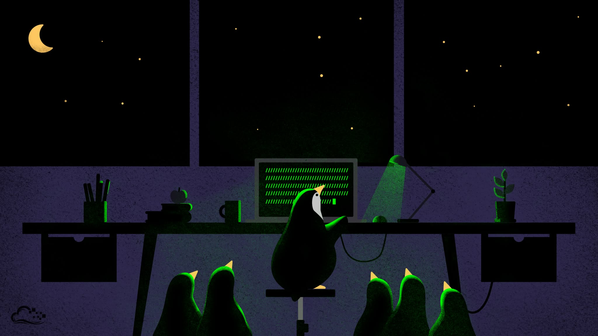

# system_perf

Diagnostic and fix scripts for a Debian hybrid GPU laptop (Intel UHD + NVIDIA RTX 4060).

## Hardware

- Intel UHD Graphics (card0) — primary GPU, runs Xorg
- NVIDIA RTX 4060 Mobile (card1) — offload GPU, PRIME Render Offload
- Physical HDMI port is wired to the NVIDIA GPU (xrandr output: `HDMI-1-0`)
- External monitor (LG) connected via DisplayPort on Intel GPU (`DP-2`)

## Scripts

### HDMI Troubleshooting

Use these when the HDMI monitor is not detected. Run in order — each step is progressively more disruptive.

| Script | Root | Description |
|--------|------|-------------|
| `hdmi_diagnose.sh` | No | Check display outputs, GPU power state, driver versions, Xorg logs, and GRUB parameters. Start here. |
| `hdmi_fix_power.sh` | Yes | Force NVIDIA GPU power to stay on. Fixes cases where runtime PM suspended the GPU and broke hotplug detection. Non-destructive. |
| `hdmi_fix_reload.sh` | Yes | Unload and reload all NVIDIA kernel modules. **Kills the current X session** — save all work first. Restarts the display manager automatically. |
| `hdmi_activate.sh` | No | Activate HDMI-1-0 after it shows "connected" in xrandr. Accepts a position argument: `right` (default), `left`, `above`, `below`, `mirror`. |

**Typical workflow:**

```bash
./hdmi_diagnose.sh               # What's wrong?
sudo ./hdmi_fix_power.sh         # Try forcing GPU power on
sudo ./hdmi_fix_reload.sh        # If still broken, reload modules (kills session)
./hdmi_activate.sh               # After login, turn on the display
```

### KWin / Compositor

| Script | Root | Description |
|--------|------|-------------|
| `diagnose_kwin.sh` | Yes | eBPF-based diagnostic for kwin_wayland high CPU usage. Profiles syscalls, DRM events, scheduler latency, ioctl calls, and fd activity. Requires `bpftrace`. |
| `fix_kwin_gpu.sh` | No* | Interactive tool to test kwin_wayland with different GPU configurations (single GPU, render nodes). Can generate a systemd user override to persist the setting. *Root needed to inspect process FDs. |

### GPU / NVIDIA Driver

| Script | Root | Description |
|--------|------|-------------|
| `gpu_diagnostic.sh` | Yes | General GPU diagnostic report: PCI devices, driver status, kernel modules, dmesg errors, installed packages, OpenGL renderer, CUDA version. |
| `fix_nvidia.sh` | Yes | Reinstall/downgrade NVIDIA packages to version 575.57.08-1. Use only if a driver version mismatch is confirmed. |

## GRUB Parameters

Current NVIDIA-related kernel parameters in `/etc/default/grub`:

```
nvidia-drm.modeset=1 nvidia.NVreg_DynamicPowerManagement=0x00
```

- `nvidia-drm.modeset=1` — required for PRIME Render Offload
- `nvidia.NVreg_DynamicPowerManagement=0x00` — prevents GPU runtime suspend, which can break HDMI hotplug detection

After changing GRUB parameters: `sudo update-grub && sudo reboot`
